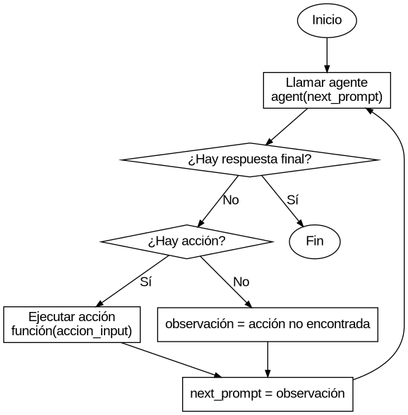

# Chatbot RAG con Agentes
Este proyecto implementa un sistema de generación de texto basado en la técnica de **Retrieval-Augmented Generation (RAG)** usando **Agentes**.
El sistema de agentes se utiliza para que responda de manera eficiente dependiendo de qué persona se está preguntando (1 agente por persona).
Cuando no se nombra a nadie en la query, se utiliza un agente por defecto.
Si se consulta por más de un CV, se trae el contexto de cada uno y se responde de manera acorde.

El sistema implementado sigue este flujo:

Carga de datos:
- Se cargan los curriculums desde un archivo csv
- Se extraen los nombres de las personas de los CVs
- Se generan embeddings para cada curriculum y se suben a Pinecone

Análisis de la consulta:
- Cuando el usuario hace una pregunta, se analiza para detectar menciones de nombres
- Si se detecta un nombre, se usa el agente específico para esa persona
- Si no se detecta ningún nombre, se usa el agente de una persona por defecto

Generación de la respuesta:
- Se utiliza el contexto de el/los curriculum/s recuperados para generar una respuesta
- Si se mencionan múltiples personas, se incluye información de todos los CVs relevantes


## Diagrama de flujo



## Estructura del proyecto
El proyecto está dividido en tres partes principales:

1. **`notebook.ipynb`**:
   - Notebook interactivo para realizar pruebas y configuraciones.
   - Permite cargar datos, generar embeddings y realizar consultas de manera interactiva.

2. **`streamlit_app.py`**:
   - Archivo independiente que implementa la interfaz gráfica del chatbot usando Streamlit.
   - Permite al usuario interactuar con el sistema de manera sencilla.

3. **`utils.py`**:
   - Contiene funciones reutilizables para inicializar Pinecone, generar embeddings, cargar vectores y realizar búsquedas.
   - Este archivo centraliza la lógica común para evitar duplicación de código.

4. **`agent.py`**:
   - Define el ciclo de conversación estructurado con un LLM para consultar CVs, gestionando acciones, observaciones y respuestas.
   - Incluye la clase `GroqAgent` y la función `query_with_agent` para orquestar la interacción paso a paso.


## Requisitos

### Software
- Python 3.8 o superior
- Jupyter Notebook
- Streamlit

### Bibliotecas
Instala las bibliotecas listadas en `requirements.txt` usando `pip`:

```bash
pip install -r requirements.txt
```

### Variables de Entorno
- `PINECONE_API_KEY`: clave API de Pinecone.
- `PINECONE_CLOUD`: cloud de Pinecone (por ejemplo, `aws`).
- `PINECONE_REGION`: region de Pinecone (por ejemplo, `us-east-1`).
- `PINECONE_INDEX_NAME`: nombre del índice en Pinecone (por defecto `cv-index`).


## Ejecución

1. Notebook interactivo
   - Abrir el archivo `notebook.ipynb` en Jupyter Notebook.
   - Ejecutar las celdas para inicializar Pinecone, generar y subir los embeddings.

2. Interfaz gráfica con Streamlit
   - Ejecutar el siguiente comando: `streamlit run streamlit_app.py`
   - Se abrirá una ventana en el navegador con la interfaz gráfica del chatbot.


## Ejemplo


